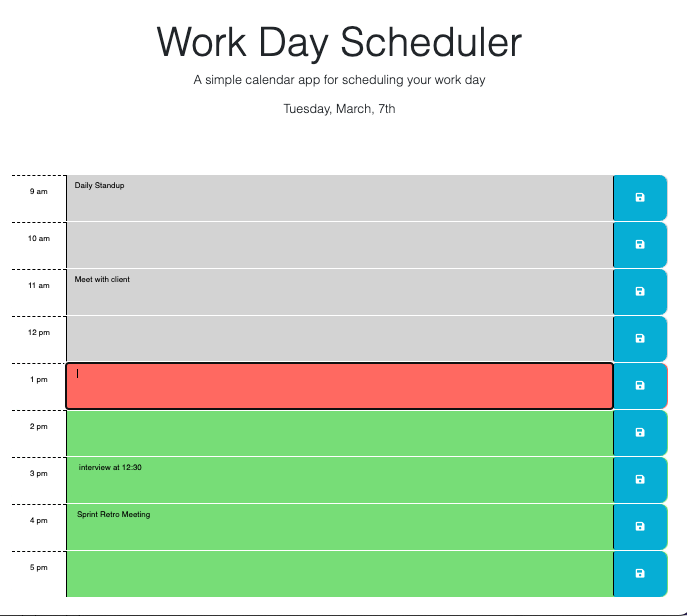

# Work Day Scheduler
Work Day Scheduler

## Author: 
Mark Edwards

## Deployment:
[Live](https://mark-227-g.github.io/workday/)
## User Story

```md
AS AN employee with a busy schedule
I WANT to add important events to a daily planner
SO THAT I can manage my time effectively
```

## Acceptance Criteria

```md
GIVEN I am using a daily planner to create a schedule
WHEN I open the planner
THEN the current day is displayed at the top of the calendar
WHEN I scroll down
THEN I am presented with timeblocks for standard business hours
WHEN I view the timeblocks for that day
THEN each timeblock is color coded to indicate whether it is in the past, present, or future
WHEN I click into a timeblock
THEN I can enter an event
WHEN I click the save button for that timeblock
THEN the text for that event is saved in local storage
WHEN I refresh the page
THEN the saved events persist
```

#### screenshots
##### 
##### 

#### Technology used:
* HTML5 
* CSS3
* Javascript
* jQuery
* Moment.js
* Bootstrap
* font awesome
* Deployed using github pages

#### References:

* [W3schools](https://www.w3schools.com/html/html5_semantic_elements.asp)
* [jQuery](https://jqueryui.com)
* [Day.js](https://day.js.org/)
* [Moment.js](https://momentjs.com/docs/)
* [Bootstrap](https://getbootstrap.com/)
* [font awesome] (https://fontawesome.com/)


